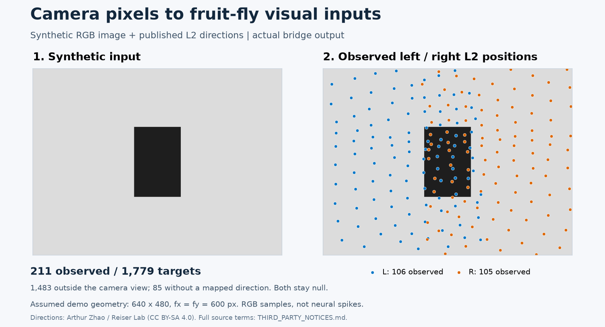

# Fruit-fly-vision-bridge

**Connect a webcam to a simulated fruit-fly brain, with explicit visual mapping and reproducible checks.**

A Python camera bridge for **Drosophila / MaleCNS**: map RGB pixels to published left- and right-eye L2 directions, drive the external BrainCPU simulator, and inspect downstream activity. Intel RealSense **D435i** adds depth and IMU through a separate recording and replay workflow. This is an experimental integration; the brightness-to-neural-drive rule is an engineering approximation, not a validated biological response model.

[中文说明](README.zh-CN.md) · [Quick start](#quick-start-no-hardware) · [Live webcam](#connect-a-webcam-to-the-brain) · [Installation](docs/installation.md) · [Findings](docs/findings.md) · [Contributing](CONTRIBUTING.md)



*Actual output of the synthetic demo below, using assumed camera geometry. Blue: left eye; orange: right eye. These are RGB samples, not neural spikes. [Reproduce this figure and see data attribution](docs/assets/README.md).*

The live path is **camera RGB → published L2 directions → engineering input rates → persistent BrainCPU → simulated downstream activity**. Depth and IMU remain auxiliary geometry; an ordinary webcam needs neither.

## Choose your input

| Input / workflow | What you can do | Current evidence |
|---|---|---|
| [Synthetic demo](#quick-start-no-hardware) or [saved RGB image](docs/cameras.md#saved-images-and-single-frame-rgb-webcam-samples) | Export per-ID brightness and validity without the full brain model | Hardware-free implementation checks |
| [Logitech BRIO on Windows](#connect-a-webcam-to-the-brain) | Run the live brain bridge through FFmpeg / DirectShow | Right-eye physical run passed; binocular full-model replay passed; fresh binocular capture pending |
| [Other USB / built-in RGB webcams](#connect-a-webcam-to-the-brain) | Select an OpenCV camera index and run the same live pipeline | Adapter implemented; this backend still needs hardware qualification |
| [Intel RealSense D435i](docs/cameras.md#d435i-recorded-experimental-path) | Record RGB + depth + IMU, replay mappings and run screen experiments | Recorded geometry and controlled screen experiments; separate from the live RGB entry |
| [Offline model comparison](#compare-visual-encoders-offline) | Compare L2, FlyDrones and Flyvis on shared stimuli | Frozen synthetic predictions and diagnostics; optional models installed separately |
| [FlyDrones L2 adapter](docs/flydrones.md) | Replace index-order input mapping with published per-body-ID positions; pass rates to native Brain or install in Pilot | [Full native network checks](docs/flydrones-full-network.md): 166,700 neurons / 10,520,377 connections (≥3 synapses), bilateral inputs, causal controls and existing D435 replay; physiological validity remains open |

Both-eye mapping is available. A single camera observes only the directions inside its field of view; it does not supply two measured eye origins or full compound-eye coverage. See [binocular setup](docs/binocular.md).

## Quick start: no hardware

Requires **Python 3.11+ and Git**. The mapping data are included. No camera, Node.js, RealSense SDK or whole-brain model is needed for this demo.

```sh
git clone https://github.com/DylanZhangzzz/Fruit-fly-vision-bridge.git
cd Fruit-fly-vision-bridge
python -m venv .venv
```

Activate the environment with **one** command for your shell:

```powershell
# Windows PowerShell
.venv\Scripts\Activate.ps1
```

```sh
# Linux / macOS
source .venv/bin/activate
```

Then run:

```sh
python -m pip install -e .
python -m flyvisionbridge.cli --demo --eyes both --output outputs/demo
python scripts/run_checks.py --core-only
```

Expected demo message: **`Saved 1779 channels; 211 observed.`** It writes `rgb.png`, `intrinsics.json` and `channels.json` to `outputs/demo/`. In this specific synthetic geometry, 106 left-eye and 105 right-eye channels see the image. The other 1,568 entries remain null because they are out of view or lack a mapped direction. This is not a fixed camera-coverage limit, and the demo does not generate firing rates.

Choose a fresh output directory when rerunning, for example `outputs/demo-02`. If PowerShell activation is unavailable, use `.venv\Scripts\python.exe` in place of `python`; no system policy change is needed. The core check command skips optional-dependency checks when their dependencies are absent. See [installation](docs/installation.md) for the full suite.

## Connect a webcam to the brain

First complete the environment setup above. Install **Node.js 22.12+**, **Git LFS**, and the **separate upstream model** using [the model installation steps](docs/installation.md#reports-and-optional-whole-brain-replay). The model requires substantial downloads and retains its own licenses. Replace `PATH_TO_FRUIT_FLY_SIMULATION` below with the directory containing `src/brain.js` and `public/data/manifest.json`.

```sh
python -m pip install -e ".[analysis]"
```

**Ordinary USB or built-in webcam, using OpenCV:**

```sh
python -m flyvisionbridge.live --model-dir PATH_TO_FRUIT_FLY_SIMULATION --camera 0 --assume-hfov 90 --eyes both
```

`0` is a camera index; choose the index of your intended device. This adapter is implemented, but the recorded hardware qualification below used FFmpeg instead.

**Tested Windows BRIO capture route, using FFmpeg:** install FFmpeg on PATH, then run:

```powershell
python -m flyvisionbridge.live --model-dir PATH_TO_FRUIT_FLY_SIMULATION --device-name "Logitech BRIO" --assume-hfov 90 --eyes both
```

Open **http://127.0.0.1:8771/** and press **开始采集** (Start capture). A default run lasts 60 seconds, displays input and downstream model activity, and releases the camera when finished. Press Ctrl+C to stop the server. Camera frames are processed locally; recordings stay in ignored `outputs/webcam-live/`.

`--assume-hfov 90` is an explicit provisional field-of-view assumption, **not a measured camera calibration**. Use `--intrinsics camera.json` instead when calibrated intrinsics are available. Lens rectification, device selection and troubleshooting are covered in [the live webcam guide](docs/webcam-live.md).

The live default is both eyes; `--eyes left` or `--eyes right` selects one. Published maps resolve 847/886 left-eye and 847/893 right-eye L2 IDs. A saved BRIO frame drove 229 left + 217 right inputs in full-model replay; **fresh binocular hardware acquisition remains pending**. These counts depend on camera projection. See [binocular evidence](docs/binocular.md).

The historical right-eye BRIO/Windows run drove 217 visible inputs into the 166,700-neuron graph and passed zero-input, disconnected-network and half-gain controls. Default operation advances 20 ms of model time at five updates/s, nominally **0.1× wall time**. Dashboard spikes are simulated activity. [Hardware report](reports/webcam/README.md).

## Compare visual encoders offline

The [frozen offline comparison](docs/benchmark.md) runs identical flashes, gratings, moving edges and expansion/contraction through the L2 baseline, official FlyDrones sensory encoder and a checksum-verified pretrained Flyvis network. [Open the archived synthetic report](reports/benchmark/index.html) after cloning. This optional workflow is separate from the quick-start demo and live engineering input rule.

Flyvis L2 can also be read out at projected MaleCNS image positions. This is image-space interpolation, not a validated neuron identity map. These are predictions and engineering diagnostics, not new live-fly validation.

## Current evidence

| Layer | Result | What it establishes |
|---|---|---|
| Published anatomy | Right: 847/893 IDs, 846 columns; left: 847/886 IDs, 847 columns; 85 IDs unresolved across both eyes | Exact eye-specific joins to author-published cross-specimen anatomical estimates |
| Controlled screen → D435i | 21 L2 IDs / 20 columns passed the recorded temporal engineering criteria, at approximately 59.53 RGB frames/s | Transmission under the tested geometry and fixed black/white reference patches |
| Public L2 physiology | 103 selected ROI records from 13 flies, whole-fly leave-one-out: mean r=0.750, R²=0.447, RMSE=0.00663 ΔF/F | Limited same-study, same-flash-type cross-fly prediction |
| Important failures | 5 selected records had R²≤0; parameters reached bounds in 10/14 total folds | No universal cell pass, unique parameter identification, or new-stimulus validation |

The recurrent model improves over a separately fitted feedback-free model for 11/13 flies, but has **no demonstrated advantage over the training-fly mean waveform template** for the same stimulus. ROI records are not MaleCNS neuron IDs. Detailed provenance, negative results, units and exclusions are in [the findings](docs/findings.md).

## Reproduce the research workflows

```sh
python -m pip install -e ".[analysis,camera]"
python scripts/run_checks.py
python camera_lab/biomapping/import_atlas.py
python camera_lab/biomapping/import_author_map.py
# Public physiology data are optional and downloaded separately:
python scripts/fetch_data.py
python camera_lab/biomapping/validate_l2_cells.py
```

Dryad sometimes requires a normal browser download. The fetcher prints the official page and accepts `--from-directory PATH`; it verifies the same SHA-256 either way. See [installation and data](docs/installation.md). Hardware-free implementation checks do not download the 117 MB physiology recording or acquire camera frames.

For **D435i**, use the existing bounded RGB-D-IMU recorder and controlled screen experiment. For an **ordinary RGB webcam**, use the [live brain bridge](docs/webcam-live.md); the BRIO/Windows FFmpeg path has been physically exercised. OpenCV-indexed hardware still needs separate qualification. For a **saved image or single-frame sample**, use the camera-independent RGB CLI with explicit rectified intrinsics. See [camera instructions](docs/cameras.md). Other depth cameras must supply their own registration and timestamp adapter.

## Project layout

```text
flyvisionbridge/           Frame contract, single-frame CLI, live camera/brain worker and dashboard
camera_lab/               D435i acquisition, calibration and historical BrainCPU tools
  biomapping/             Anatomical joins, screen experiments, physiology benchmarks
    source/               Small licensed mapping inputs and public-data manifest
    data/                 Derived mappings and provenance
scripts/                  Source verification, data acquisition, unified checks
tests/                    Camera-independent bridge tests
docs/                     Installation, mapping, validation, findings and roadmap
reports/                  Shareable archived results, with limitations
.github/                  CI, issue forms and pull-request template
```

Open [reports/index.html](reports/index.html) after cloning, or run `python -m http.server 8000 --bind 127.0.0.1` and visit `http://127.0.0.1:8000/reports/`. GitHub displays HTML source rather than running the interactive report. Raw camera videos, room images, device serials, virtual environments and full connectome weights are excluded.

## Scope and next work

- Missing directions and out-of-view rays stay unknown; a narrow camera is not stretched across the whole compound eye.
- Weighted RGB code is not calibrated radiance. Depth is not an extra fly range sensor; IMU is not injected into invented fly neurons.
- The historical `120*(1-L)` Hz input is an engineering stimulus. The physiology output is ASAP2f ΔF/F, not mV or Hz; neither is silently substituted for the other.
- Camera mounting, IMU bias/timing, photoreceptor acceptance angles and natural-scene responses remain unvalidated.
- The next physiology milestone is **frozen-parameter prediction of genuinely held-out stimulus conditions**, with appropriate independent recordings and baselines. It has not been completed here.

Read [validation](docs/validation.md), [mapping](docs/mapping.md), and [roadmap](docs/roadmap.md) before interpreting a passing test as biological evidence.

Contributions and questions are welcome in [Issues](https://github.com/DylanZhangzzz/Fruit-fly-vision-bridge/issues). Follow [CONTRIBUTING.md](CONTRIBUTING.md), especially when adding a camera adapter, public dataset or scientific claim.

## Sources and licensing

Original project code and documentation are available under the [MIT License](LICENSE). Third-party files and derived data retain their stated terms, including GPL-3.0, CC BY-SA 4.0 and CC BY 4.0 for mapping resources; the public Dryad physiology dataset is CC0. The Python distribution includes both code and mapping data, so its license metadata lists those licenses together. MIT does not replace a dataset's license. See [THIRD_PARTY_NOTICES.md](THIRD_PARTY_NOTICES.md), [sources](docs/sources.md) and [CITATION.cff](CITATION.cff). This is an independent integration and validation project; upstream authors did not validate this bridge.

The [source-publication rights review](docs/license-review.md) documents verified licenses, fixes and unresolved author-code/model-weight boundaries. It is not a legal non-infringement guarantee. Package metadata uses `MIT AND GPL-3.0-only AND CC-BY-SA-4.0 AND CC-BY-4.0` for the mixed code/data collection; this does not change the original code license.
