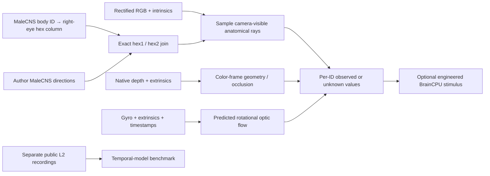

# Mapping pipeline

## Which source contributes what?

1. `ME_assigned_columns.csv` supplies MaleCNS body IDs, cell types and assigned hex columns. The second `ME_columnar-cells_location.xlsx` source checks identity-to-column agreement by ID, not row order.
2. Reiser lab `eyemap_T4` supplies **778 reference rays** combining FAFB anatomy and micro-CT eye information. Those reference indices are not MaleCNS neuron IDs.
3. Arthur Zhao's `eyemap-archive` supplies a **separate MaleCNS right-eye output** with both exact column keys and 3D unit directions. It permits an exact join for 847 L2 IDs. The private generation pipeline is not reimplemented here; this project uses the published output.
4. This project joins, validates conventions, preserves missing/ambiguous entries, projects into the camera, samples observations and checks the resulting pipeline.

The final table is `camera_lab/biomapping/data/malecns_author_crosswalk.json`. There are 893 targets, 847 resolved IDs, 846 resolved columns and 46 missing directions. IDs 43130 and 56150 share column `(25,10)` and therefore the same ray; assigning different visual positions to them would fabricate information.

## Coordinates

- Head/reference frame: x forward, y left, z up; positive azimuth is left.
- Camera frame: x right, y down, z forward.
- Author angle conversion: `azimuth_left = -phi`, `elevation = 90 - theta`.
- Default `R_head_from_camera = [[0,0,1],[-1,0,0],[0,-1,0]]` assumes a forward-facing mount. It is not measured fly-head alignment.
- Row-vector ray projection uses `ray_camera = ray_head @ R_head_from_camera` and the supplied camera intrinsics.

Rotations must be proper (orthonormal, determinant +1); reflected or scaled transforms are rejected. Rays behind/outside the camera and missing anatomical directions stay unknown. Sampling requires a complete bilinear pixel neighborhood, so the final row/column of the image is excluded. RGB is weighted camera code, not linearized radiance or photoreceptor sensitivity.

## Depth and IMU

Depth estimates observed geometry. Deproject native depth, apply the depth-to-color extrinsics, and retain the nearest projected point when multiple points hit a color pixel. Invalid depth never becomes a near object. The newer biological ray sampler permits valid RGB when depth is missing; the earlier `encode_depth.py` experiment gated by depth and remains explicitly historical.

For a stationary scene under pure camera rotation, the instantaneous predicted head-frame ray derivative is `-omega_head × ray_head`. An IMU bias or time shift invalidates precise comparison. Different timestamp domains use a marked approximate host-receipt association in the existing recorder, not a claim of synchronized exposure. IMU does not provide absolute yaw or identify a fly head orientation.

## Boundary between values and neuronal activity

`flyvisionbridge.map_frame` emits sampled values and validity. The old BrainCPU path emits `120*(1-L)` Hz as an engineered drive held for 50 ms, with zero-input and disconnected-network controls. Network propagation proves the software path works; it does not validate that transfer function. The physiology benchmark has a different observable, ASAP2f ΔF/F. There is no calibrated ΔF/F-to-Hz conversion in this project.
